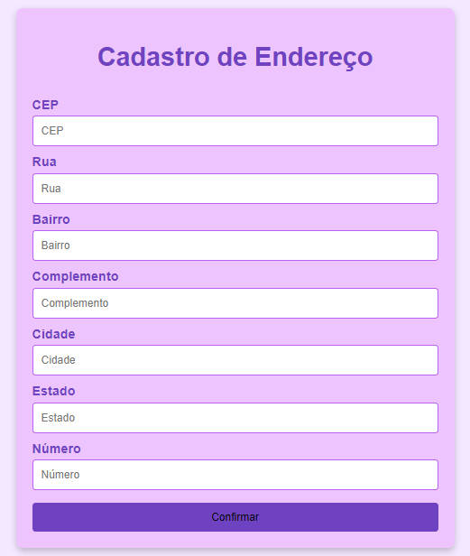

# CONSULTA DE CEP.

## Começando 🚀
Esse projeto realiza a consulta de endereços utilizando a API ViaCEP, permitindo preencher automaticamente um formulário de endereço ao inserir um CEP válido na matéria de:
* Programação Web I.

## Sobre o projeto 📋
Esse projeto foi feito em JavaScript para buscar dados de um CEP e preencher os campos de logradouro, bairro, cidade e estado. A interface é simples, pedindo apenas o CEP e preenchendo os outros campos automaticamente. Incluí fotos para facilitar a compreensão do funcionamento da aplicação.

## Código JavaScript para Consulta de CEP.
* `'use strict'` : Ativa o modo estrito no JavaScript, que ajuda a evitar erros comuns, tornando o código mais seguro.
* `const` : Declara uma variável que não pode ser reatribuída, criando uma constante que será usada ao longo do código.
* `document.getElementById('id')` : Retorna a referência de um elemento HTML através do seu ID, permitindo a manipulação de seu valor.
* `value` : Propriedade utilizada para obter ou definir o valor de um campo de entrada (input).
* `=>` : É a notação de função arrow, usada para definir funções de forma concisa.
* `async` : Define uma função assíncrona, que permite o uso de `await` para operações que retornam promessas.
* `fetch` : Faz uma requisição para o servidor, neste caso, para a API ViaCEP, retornando uma resposta.
* `json()` : Método que converte a resposta da API em um objeto JSON para ser manipulado no JavaScript.
* `alert` : Exibe uma mensagem de alerta para o usuário.
* `addEventListener('focusout')` : Adiciona um ouvinte de eventos ao elemento, executando a função de busca de CEP quando o campo de entrada perde o foco.
* `Regex (/^[0-9]+$/)` : Expressão regular que verifica se o valor do CEP contém apenas números.

### Funções do Código:
* `limparFormulario()` : Limpa os campos de endereço do formulário, deixando-os vazios.
* `preencherFormulario(endereco)` : Preenche os campos do formulário com os dados retornados pela API, como logradouro, bairro, localidade e estado.
* `eNumero(numero)` : Verifica se o valor digitado no campo de CEP é numérico.
* `cepValido(cep)` : Verifica se o CEP tem 8 dígitos e se contém apenas números.
* `pesquisarCep()` : Função principal que faz a requisição à API ViaCEP e preenche o formulário com os dados do endereço correspondente ao CEP informado.

# Fotos do projeto.

  
Tela inicial onde o usuário pode inserir o CEP.        
    
Formulário com os campos preenchidos automaticamente após a consulta do CEP válido.

## Técnicas e Tecnologias utilizadas 🔨
* Visual Studio Code
* Git Bash
* Git Hub
* HTML5
* CSS3
* JavaScript
*  [API ViaCEP](https://viacep.com.br/) 
* Live Server (A extensão Live Server permite criar um servidor local através do VSCode. Com ele é cortada a necessidade de sempre atualizar o navegador manualmente ao fazer alterações no código.)

## 🚧 Fontes utilizadas
* [Mozilla](hhttps://developer.mozilla.org/pt-BR/)
* [API ViaCEP](https://viacep.com.br/)

## Autores ✍🏻
| [ Larissa Gabrielle Fagundes Andrade.](https://github.com/gabriellefagundes) |
| :---: 